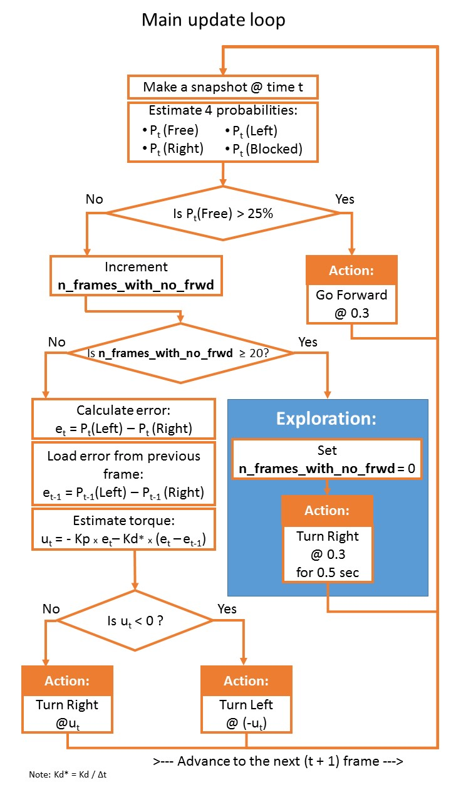

# Finding-path-in-maze-of-traffic-cones
This project explains how to apply transfer learning to teach NVIDIA JetBot to navigate a maze of toy traffic cones with camera sensor only.  

### Motivation
Every time I drive in contraction area I am thinking how challenging it would be for self driving car to navigate through the traffic cones. It turns out it is not so difficult with new **NVIDIA's JetBot** - with only a couple hundreds images you can train a state-of-the-art deep learning model to teach your robot how to find path in a maze of toy traffic cones using only onboard camera and no other sensors.

### Demo video

### JetBot
JetBot is an open-source robot based on NVIDIA Jetson Nano kit. You can find detailed instructions on how to build and set it up [here](https://github.com/NVIDIA-AI-IOT/jetbot/wiki)

### Project overview
This project is a modified Collision avoidance example from NVIDIA JetBot Wiki. It consists of three major steps, each described in a separate Jupyter notebook:
- Collect data on JetBot - notebook ``data_collection_cones.ipynb``
- Train model on other GPU machine - notebook ``train_model_cones.ipynb``
- Run live demo on JetBot - notebook ``live_demo_cones.ipynb``

### Step 0. Build JetBot and upload Jupyter notebooks

- Build and setup JetBot as explained [here](https://github.com/NVIDIA-AI-IOT/jetbot/wiki)
- Connect to the robot by navigating to ``http://<jetbot_ip_address>:8888``
- Sign in with the default password ``jetbot``
- Shutdown all other running notebooks by selecting ``Kernel -> Shutdown All Kernels...``
- Navigate to ``~/Notebooks/``
- Create new subfolder ``~/Notebooks/traffic_cones_driving/``
- Upload ``data_collection_cones.ipynb`` and ``live_demo_cones.ipynb`` to  ``~/Notebooks/traffic_cones_driving/``

**IMPORTANT:** The Jupyter notebooks ``data_collection_cones.ipynb`` and ``live_demo_cones.ipynb`` referenced in Steps 1 and 3 below should be run on JetBot while ``train_model_cones.ipynb`` in Step 2 - on a computer with GPU. Therefore we have to upload  ``data_collection_cones.ipynb`` and ``live_demo_cones.ipynb`` to the JetBot and place them in ``~/Notebooks/traffic_cones_driving/``

### Step 1. Collecting data on JetBot

We will collect an image classification dataset that will be used to help keep JetBot operate in a maze of the traffic cones. JetBot will learn to estimate probabilities of  four scenarios (classes):
- **Free** - it is safe to move forward
- **Blocked** - there is an obstacle in front of the robot
- **Left** - robot should spin to the left
- **Right** - robot should spin to the right

To collect the training data on JetBot we will use Jupyter notebook ``data_collection_cones.ipynb`` which contains details instructions. To run this notebook on JetBot, follow the next steps:
- Connect to your robot by navigating to ``http://<jetbot_ip_address>:8888``
- Sign in with the default password ``jetbot``
- Shutdown all other running notebooks by selecting ``Kernel -> Shutdown All Kernels...``
- Navigate to ``~/Notebooks/traffic_cones_driving/``
- Open and follow the ``data_collection_cones.ipynb`` notebook

### Step 2. Train neural network on GPU machine

Next, we will use the collected data to re-train the deep learning model AlexNet on GPU machine (host) by running  train_model_cones.ipynb. 

**Note that ``train_model_cones.ipynb`` is the only Jupyter notebook in this tutorial which is run NOT on the JetBot.**

- Connect to a GPU machine with PyTorch installed and a Jupyter Lab server running
- Upload ``train_model_cones.ipynb`` notebook and to this machine
- Upload  ``dataset_cones.zip`` file that you created in the ``data_collection_cones.ipynb`` notebook and extract this dataset. (After this step a folder named ``dataset_cones`` appear in the file browser.)
- Open and follow the ``train_model_cones.ipynb`` notebook

At the end of this second step you will create a model - the file ``best_model_cones.pth`` which then has to be uploaded to the JetBot to run the live demo.

### Step 3 - Run live demo on JetBot

This final step is to upload the model best_model_cones.pth to the JetBot and run it.
- Power your robot from the USB battery pack
- Connect back to your robot by navigating to ``http://<jetbot_ip_address>:8888``
- Sign in with the default password ``jetbot``
- Shutdown all other running notebooks by selecting ``Kernel -> Shutdown All Kernels...``
- Navigate to ``~/Notebooks/traffic_cones_driving``
- Open and follow the ``live_demo_cones.ipynb notebook``

Start cautious and give JetBot enough space to move around. Try different cone configuration and see how well the robot performs in different environments, lighting, etc. While the notebook live_demo_cones.ipynb explains all steps in detail, the following chart shows the logic of robot moves given the probabilities predicted by the models.

This notebook also explains how to store the history of robot moves with free/left/right/blocked probabilities predicted by the model and how to make two FPV (First Person View) videos (at 1 fps and 15 fps rates) with superimposed telemetry and JetBot actions data. Those are useful for debugging, PD controller tuning and model improvement.

### Have fun and let me know if you have questions! :-)
